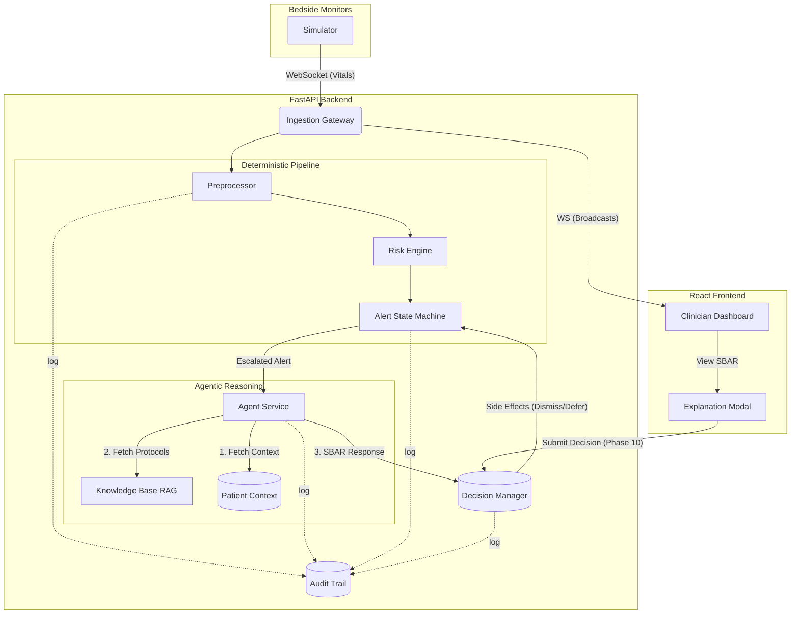

# Clinical Decision-Support System (CDSS)

A real-time agentic Clinical Decision-Support System that ingests high-frequency patient vitals, deterministically evaluates physiological deterioration, and generates context-aware LLM reasoning (SBAR) when an alert is triggered.

## Architecture



## Setup & Demo Instructions

### 1. Backend Setup
```bash
cd backend
python -m venv venv
# Windows
.\venv\Scripts\activate
# Linux/Mac
# source venv/bin/activate

pip install -r requirements.txt

# (Optional) Set your OpenAI API key for live LLM reasoning.
# If not set, the system uses a deterministic mock agent.
echo "OPENAI_API_KEY=sk-your-key" > .env

# Run the FastAPI server (includes embedded simulator)
python ingestion/main.py
```

### 2. Frontend Setup
```bash
cd frontend
npm install
npm start
```

### 3. Demo Flow
1. Open the dashboard at `http://localhost:3000`. You will see 8 patients with simulated real-time vital streams.
2. Watch as patients deteriorate over time (e.g., P002 progressing into Sepsis).
3. When a patient reaches **ESCALATED** status, they move to the top of the list and a notification appears.
4. Click **View SBAR Report** to see the AI-generated clinical reasoning, which synthesises the real-time vitals, the patient's static clinical context (Phase 9), and clinical protocols.
5. Provide a **Clinician Decision** (Accept, Dismiss, Defer, Investigate) (Phase 10).
6. View the **Audit Trail** tab to see the explainability trace for the entire alert episode (Phase 11).

## Implementation Phases
- Phase 1-5: Simulator, Ingestion, Preprocessing, Risk Engine, Alert State Machine
- Phase 6-8: Agent Service, RAG Knowledge Base, Frontend Dashboard
- Phase 9: Static Per-Patient Clinical Context Integration
- Phase 10: Clinician-in-the-Loop Decision Workflow
- Phase 11: Full Audit Trail
- Phase 12: Documentation & Deliverables
