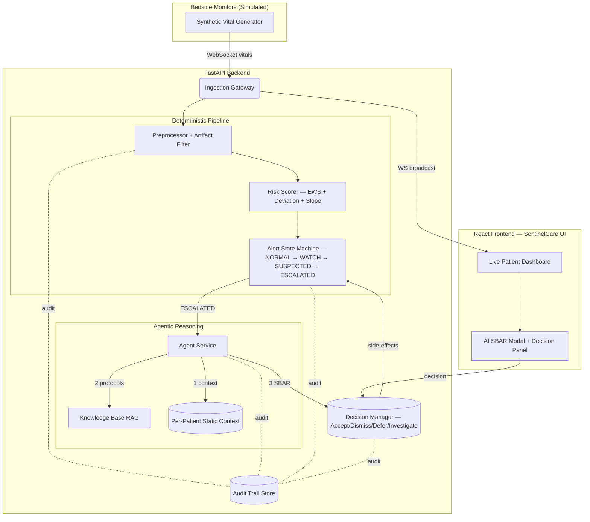

# 🏥 SentinelCare — Agentic Clinical Deterioration & Escalation Copilot

> **Track:** Agentic AI Systems (Healthcare) — Intra-IIT Hackathon

A real-time, agentic clinical decision-support system that watches a stream of patient vitals, maintains an evolving picture of each patient's state, recognizes **multi-parameter deterioration trends**, and escalates the right cases to a clinician with a clear, evidence-grounded explanation.

---

## ✨ Key Features

| Feature | Description |
|---|---|
| 🔴 **Real-time Vitals Stream** | HR, SpO₂, RR, BP streamed via WebSocket — no static batching |
| 🧠 **Agentic Reasoning** | LLM-powered SBAR generation with RAG over clinical protocols |
| 📊 **Multi-parameter Trending** | Detects deterioration trajectories, not single-threshold spikes |
| 🎯 **Risk-Scored Prioritisation** | Ranks patients by urgency; suppresses non-actionable re-alerts |
| 🩺 **Clinician-in-the-Loop** | Accept / Dismiss / Defer / Investigate decisions per alert |
| 📋 **Full Audit Trail** | Every observation, retrieval, reasoning step and decision logged |
| 🌑 **Dark AI Dashboard** | Glassmorphism React UI with live charts and escalation toasts |

---

## 🏗️ Architecture



---

## 🚀 Setup & Demo Instructions

### Prerequisites
- Python 3.10+
- Node.js 18+
- (Optional) OpenAI API key for live LLM reasoning

### 1. Backend Setup

```bash
cd backend

# Create virtual environment
python -m venv venv

# Activate (Windows)
.\venv\Scripts\activate
# Activate (Linux/Mac)
# source venv/bin/activate

pip install -r requirements.txt

# Set API key (optional — falls back to deterministic mock)
copy .env.example .env
# Edit .env and add: OPENAI_API_KEY=sk-your-key

# Start FastAPI server (auto-starts simulator)
python ingestion/main.py
```

The backend runs at `http://localhost:8000`.  
API docs: `http://localhost:8000/docs`

### 2. Frontend Setup

```bash
cd frontend
npm install
npm run dev
```

Open `http://localhost:5173` in your browser.

### 3. Demo Flow

1. **Watch the cohort** — 8 patients with different scenarios (stable, gradual deterioration, COPD exacerbation, sudden crisis, etc.)
2. **Vitals stream live** — every 5 seconds, heart rate, SpO₂, respiratory rate and blood pressure update in real time
3. **Escalation occurs** — patients deteriorating past threshold reach **ESCALATED** status, triggering a toast notification and red banner
4. **Open SBAR Report** — click _AI SBAR Report_ to see the LLM's situation/background/assessment/recommendation grounded in retrieved clinical protocols
5. **Make a decision** — Accept, Dismiss (suppress 30 min), Defer (15 min), or Investigate
6. **Audit Trail** — the _Audit Trail_ tab shows every step: observations → retrieval → reasoning → alert → decision

---

## 📁 Project Structure

```
.
├── backend/
│   ├── agent/              # SBAR reasoning, RAG, patient context
│   ├── alerts/             # Alert state machine, decision manager
│   ├── database/           # In-memory state and audit stores
│   ├── engine/             # Preprocessor, risk scorer, trend detector
│   ├── ingestion/          # FastAPI app, WebSocket gateway
│   ├── simulator/          # Synthetic patient & vital generators
│   └── state/              # Per-patient live state
├── frontend/
│   └── src/
│       ├── components/     # Dashboard, PatientCard, DetailPanel, ExplanationModal, Toast
│       ├── types.ts        # TypeScript interfaces
│       └── index.css       # Dark glassmorphism design system
└── docs/
    ├── system_design.md
    └── midterm_report.md
```

---

## 📊 Evaluation Alignment

| Criterion | Weight | How We Address It |
|---|---|---|
| Solution idea & innovation | 20% | Agentic loop with RAG-grounded SBAR, multi-param trend detection, EWS scoring |
| Code structure & architecture | 40% | Layered deterministic pipeline → agentic reasoning → clinician decision loop, mirrors proposed design |
| Demo explanation & reasoning | 25% | Full audit trail, SBAR sections, protocol citations, decision history |
| Output accuracy | 15% | EWS-calibrated thresholds, artifact filtering, suppression logic |

---

## 🛠️ Tech Stack

**Backend:** Python · FastAPI · WebSockets · OpenAI (optional) · In-memory stores  
**Frontend:** React 19 · TypeScript · Vite · Recharts · Tailwind CSS v4  
**AI/ML:** RAG over clinical guidelines · EWS risk scoring · Multi-parameter trend detection
