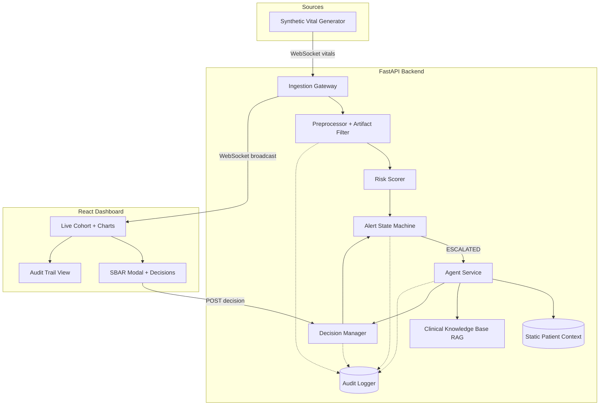

# SentinelCare — Agentic Clinical Deterioration & Escalation Copilot

**Track:** Agentic AI Systems (Healthcare) — Intra-IIT Hackathon  
**Product name:** SentinelCare  
**Repository:** GitHub (see README in project root)  
**Document version:** 1.0  
**Date:** September 2026  

---

## Table of Contents

1. [Executive Summary](#1-executive-summary)  
2. [Problem Statement & Motivation](#2-problem-statement--motivation)  
3. [Solution Overview](#3-solution-overview)  
4. [Core Requirements — Traceability](#4-core-requirements--traceability)  
5. [System Architecture](#5-system-architecture)  
6. [Implementation Details](#6-implementation-details)  
7. [Synthetic Data & Clinical Scenarios](#7-synthetic-data--clinical-scenarios)  
8. [Clinician Workflow & Audit Trail](#8-clinician-workflow--audit-trail)  
9. [Setup & Installation](#9-setup--installation)  
10. [Demo Instructions](#10-demo-instructions)  
11. [Midterm Report — Solution Steps](#11-midterm-report--solution-steps)  
12. [Evaluation Criteria Alignment](#12-evaluation-criteria-alignment)  
13. [Limitations & Future Work](#13-limitations--future-work)  
14. [Appendix](#14-appendix)  

---

## 1. Executive Summary

Hospitals generate continuous streams of vital signs, yet clinicians cannot watch every parameter on every patient in real time. Fixed single-threshold alarms create **alarm fatigue**: many false or non-actionable alerts obscure patients who are genuinely deteriorating.

**SentinelCare** is a real-time, **agentic** clinical decision-support copilot that:

- Ingests a **live vitals stream** (heart rate, SpO₂, respiratory rate, blood pressure) per patient.  
- Maintains an **evolving, stateful patient profile** merged with static clinical context (age, history, medications, recent labs).  
- Detects **multi-parameter deterioration trends** using deviation, slope, persistence, and cross-channel concordance—not isolated threshold breaches.  
- **Risk-scores and prioritises** the cohort while suppressing repetitive escalations.  
- On meaningful events, **retrieves** patient context and clinical protocol text (RAG), then **generates an explainable SBAR escalation** for the clinician.  
- Keeps the **clinician in the loop** (accept, dismiss, defer, investigate) and records a **full audit trail** for post-hoc review.

The design deliberately separates a **fast deterministic safety layer** from a **slower agentic explanation layer**, so alerts are never blocked by LLM latency or API failures.

---

## 2. Problem Statement & Motivation

### 2.1 Background

Bedside monitors, wearables, labs, and EHRs produce rich patient data. For at-risk patients, physiological change can be rapid. Periodic ward rounds and single-parameter alarm limits often miss **coordinated multi-system decline** (e.g., rising heart rate with falling blood pressure and SpO₂).

### 2.2 The Challenge

Build a system that:

| Goal | Rationale |
|------|-----------|
| Stream processing | Vitals arrive over time; batch analysis misses trajectory |
| Stateful memory | Each patient’s picture must update incrementally |
| Trend detection | Genuine deterioration often involves several signals moving together |
| Prioritisation | Rank urgency across a cohort; reduce noise |
| Grounded reasoning | Tie recommendations to static context and guidelines |
| Explainability | Plain language + evidence, not only a numeric score |
| Human oversight | Clinician validates every recommendation |
| Auditability | Reconstruct what was seen, retrieved, reasoned, and decided |

### 2.3 Hackathon Scope (As Implemented)

| In scope | Implementation |
|----------|----------------|
| Core vitals stream | HR, SpO₂, RR, systolic/diastolic BP via WebSocket |
| Static patient context | Profiles in `patient_context_data.py`; exposed via REST |
| Labs, meds, history | Embedded in static context for agent grounding |
| Synthetic streaming | Embedded simulator in FastAPI lifespan |
| Clinician decisions | Accept / Dismiss / Defer / Investigate |
| Audit trail | Correlation-ID–linked event chain |

---

## 3. Solution Overview

SentinelCare implements a **hybrid architecture**:

1. **Ingestion gateway** — FastAPI receives vitals (simulator or external WebSocket clients), validates with Pydantic, updates per-patient state, broadcasts to the dashboard.  
2. **Deterministic pipeline** — Preprocessor → composite risk scorer → alert state machine. Sub-second, repeatable, auditable.  
3. **Agentic layer** — Triggered only on **ESCALATED** alerts: fetch static **PatientContext**, **RAG** over protocol documents, LLM **SBAR** (Situation, Background, Assessment, Recommendation). Falls back to deterministic mock SBAR without `OPENAI_API_KEY`.  
4. **Clinician decision manager** — Records decisions; dismiss/defer feed back into suppression and state.  
5. **React dashboard** — Live cohort view, sparklines, risk badges, escalation toasts, SBAR modal, audit tab.

**Innovation highlights:**

- **Concordance-weighted risk scoring** amplifies scores when multiple channels deteriorate together and dampens single-channel noise.  
- **Sustained-hold state machine** requires risk thresholds to hold for clinically motivated durations before escalation.  
- **Context-aware RAG** injects medications and labs so the agent can explain blunted responses (e.g., beta-blockers and heart rate).  
- **Episode-scoped audit** (`correlation_id`) links observation → retrieval → reasoning → alert → decision.

---

## 4. Core Requirements — Traceability

| Requirement | How SentinelCare Satisfies It | Primary Components |
|-------------|------------------------------|-------------------|
| Ingest vitals stream | WebSocket `/ws/vitals/{patient_id}`; readings every ~5 s | `ingestion/main.py`, `simulator/` |
| Stateful patient profile | Rolling buffers (~300 readings), baselines, risk history, alert level | `state/patient_state.py` |
| Multi-parameter trends | Per-channel deviation, slope, persistence; concordance multiplier | `engine/trend_detector.py`, `engine/risk_scorer.py` |
| Risk-score & prioritise | 0–100 composite score; cohort sorted on dashboard; cooldown/suppression | `engine/risk_scorer.py`, `alerts/state_machine.py` |
| Investigate & retrieve grounding | Static context + protocol RAG on escalation | `agent/patient_context.py`, `agent/rag.py` |
| Explainable escalation | SBAR + triggering signals + protocol citations | `agent/reasoning.py`, `agent/agent_service.py` |
| Clinician in the loop | Four decision types with side effects | `alerts/decisions.py`, frontend `ExplanationModal.tsx` |
| Audit trail | Typed events with shared `correlation_id` | `database/audit.py`, REST `/api/audit/*` |

---

## 5. System Architecture

### 5.1 Logical Architecture



### 5.2 Alert Lifecycle

States: **NORMAL → WATCH → SUSPECTED → ESCALATED** (with recovery transitions).

| Transition | Condition (summary) |
|------------|---------------------|
| NORMAL → WATCH | Risk > 25 sustained ~60 s |
| WATCH → SUSPECTED | Risk > 50 sustained ~90 s |
| SUSPECTED → ESCALATED | Risk > 72 sustained ~60 s → triggers agent + UI alert |
| Recovery | Lower risk held for longer windows to step down |
| Suppression | 15 min re-escalation cooldown; dismiss can suppress ~30 min |

ESCALATED is the **only** state that invokes the LLM agent, preserving speed and cost for routine readings.

### 5.3 Technology Stack

| Layer | Technologies |
|-------|----------------|
| Backend | Python 3.10+, FastAPI, WebSockets, Pydantic, python-dotenv |
| AI | OpenAI API (optional), keyword RAG over `.txt` protocols |
| Frontend | React 19, TypeScript, Vite, Recharts, Tailwind CSS v4 |
| Storage (prototype) | In-memory patient state, decisions, audit log |

---

## 6. Implementation Details

### 6.1 Vitals Ingestion

- Messages validated as `VitalReadingMessage` (HR, SpO₂, RR, BP, timestamp, optional artifact flag).  
- Embedded simulator starts with the API and connects one WebSocket per patient.  
- Dashboard clients subscribe to `/ws/dashboard` for cohort updates.

### 6.2 Preprocessing

- Smoothing and **artifact rejection** reduce motion-related spikes (`engine/preprocessor.py`).  
- Artifact-heavy scenarios (e.g., `ArtifactNoiseScenario`) test that isolated spikes do not alone drive escalation.

### 6.3 Trend Detection & Risk Scoring

Per channel, the engine computes:

- **Deviation** from patient baseline  
- **Slope** over a rolling window (linear trend)  
- **Persistence** of abnormality  

Channel scores combine with weights (SpO₂ and systolic BP weighted higher). A **concordance multiplier** (up to 2×) rewards simultaneous multi-channel deterioration—matching the clinical notion of systemic decline versus single-sensor noise.

### 6.4 Agentic Reasoning

On `ESCALATED`:

1. Build `ExplanationRequest` (vitals snapshot, trend summary, risk score, scenario tag).  
2. Load **PatientContext** (demographics, PMH, meds, labs, baselines).  
3. **Retrieve** protocol snippets (sepsis, COPD, hemorrhagic shock, arrhythmia, sudden crisis, etc.).  
4. Generate **SBAR** via `ClinicalReasoningAgent`; cache per patient for `GET /api/patients/{id}/explanation`.  
5. Log **retrieval** and **reasoning** audit events.

Without an API key, a **deterministic mock SBAR** preserves demo flow and audit structure.

### 6.5 Frontend Experience

- **Dashboard:** Patient cards with alert level, risk score, sparklines.  
- **Detail panel:** Multi-vital charts and history.  
- **Escalation:** Toast + banner when status becomes ESCALATED.  
- **Explanation modal:** Full SBAR, protocol references, decision buttons.  
- **Audit tab:** Chronological or correlation-grouped events.

---

## 7. Synthetic Data & Clinical Scenarios

Eight simulated patients exercise distinct trajectories (`simulator/scenarios.py`):

| Scenario class | Clinical intent |
|----------------|-----------------|
| Stable | Baseline noise only; should remain low priority |
| Gradual deterioration | Slow multi-parameter decline (e.g., evolving sepsis) |
| COPD exacerbation | Respiratory-predominant pattern |
| Sudden crisis | Abrupt cardiovascular collapse |
| Artifact noise | Transient sensor errors; tests suppression |
| Recovery | Abnormal → improving; tests downgrade path |
| Hemorrhagic shock | ↑HR, ↓BP, ↓SpO₂ concordance |
| Intermittent arrhythmia | Episodic HR irregularity vs sustained trend |

Static profiles (`simulator/patient_context_data.py`) supply age, comorbidities, medications (e.g., beta-blockers), and recent labs for agent grounding.

---

## 8. Clinician Workflow & Audit Trail

### 8.1 Decision Semantics

| Decision | Effect |
|----------|--------|
| **Accept** | Acknowledged; removed from pending review queue; monitoring continues |
| **Dismiss** | Clinically not actionable; **30 min** suppression; state machine cooldown |
| **Defer** | **15 min** snooze; re-evaluation after expiry |
| **Investigate** | Flagged for deeper review; no automatic suppression |

API: `POST /api/patients/{id}/alerts/{alert_id}/decision`

### 8.2 Audit Event Chain

Each escalation episode receives a **`correlation_id`** at first observation. Subsequent events share it:

```
observation → retrieval → reasoning → alert → decision
```

Query APIs:

- `GET /api/patients/{id}/audit` — patient history  
- `GET /api/audit/{correlation_id}` — full episode reconstruction  
- `GET /api/audit` — recent global entries  

This satisfies regulatory-style **explainability**: what data was seen, what protocols were retrieved, what the model said, and how the clinician responded.

---

## 9. Setup & Installation

### 9.1 Prerequisites

- Python 3.10 or newer  
- Node.js 18 or newer  
- Optional: OpenAI API key for live LLM SBAR  

### 9.2 Backend

```bash
cd backend
python -m venv venv
# Windows: .\venv\Scripts\activate
# Linux/macOS: source venv/bin/activate
pip install -r requirements.txt
copy .env.example .env   # Windows; use cp on Unix
# Set OPENAI_API_KEY=sk-... in .env (optional)
python ingestion/main.py
```

- Server: `http://localhost:8000`  
- OpenAPI: `http://localhost:8000/docs`  

### 9.3 Frontend

```bash
cd frontend
npm install
npm run dev
```

- UI: `http://localhost:5173`  

### 9.4 Verification

1. Open `/docs` — confirm WebSocket and REST routes listed at startup.  
2. Open dashboard — eight patients with updating vitals.  
3. Wait for deterioration scenarios — ESCALATED status and toast.  
4. Open SBAR — content present (live or mock).  
5. Submit a decision — audit entries appear under Audit Trail.

---

## 10. Demo Instructions

Recommended **5–8 minute** demo script for video submission:

1. **Context (30 s)** — Problem: alarm fatigue vs multi-parameter deterioration; introduce SentinelCare hybrid design.  
2. **Live cohort (1 min)** — Show stable vs deteriorating patients; point out risk score and alert badges updating every ~5 s.  
3. **Trend logic (1 min)** — Open a deteriorating patient; show multi-vital chart; explain concordance (HR up, BP/SpO₂ down).  
4. **Escalation (1 min)** — When ESCALATED fires, show toast; open **AI SBAR Report**. Walk through Situation, Background (static context), Assessment, Recommendation.  
5. **Grounding (1 min)** — Mention retrieved protocol (e.g., sepsis/shock guideline text) and medication-aware reasoning.  
6. **Clinician loop (1 min)** — Dismiss or Defer one alert; show suppression; Accept another.  
7. **Audit (1 min)** — Open Audit Trail; filter by patient; show `correlation_id` chain from vitals to decision.  
8. **Architecture (30 s)** — Refer to README diagram: deterministic pipeline → agent on ESCALATED only.

**Demo video:** Host on YouTube/Drive and add the link to README and hackathon submission form.

---

## 11. Midterm Report — Solution Steps

The project was delivered in phased increments (aligned with `docs/midterm_report.md`):

| Phase | Deliverable |
|-------|-------------|
| 1–2 | Patient profiles + synthetic vital generator |
| 3 | FastAPI ingestion + WebSocket streaming |
| 4 | Preprocessor, EWS-oriented risk engine, trend detector |
| 5 | Alert state machine with sustained holds and cooldowns |
| 6–7 | Agent service + RAG + SBAR generation + REST explanation API |
| 8 | React dashboard (live vitals, risk, modal) |
| 9 | Static **PatientContext** injected into RAG prompts |
| 10 | Clinician decision workflow with feedback to state machine |
| 11 | Full audit trail with correlation IDs |
| 12 | UI polish, cohort stats, documentation |

### Key design decisions

1. **LLM as synthesiser, not primary detector** — Avoids latency/cost on every tick and reduces hallucination on raw numbers.  
2. **Context + protocol dual grounding** — Reduces false clinical narratives for complex patients.  
3. **Dismiss/defer feedback** — Makes the system usable in real wards where alarm fatigue is the main adoption barrier.

---

## 12. Evaluation Criteria Alignment

| Criterion | Weight | Evidence in Submission |
|-----------|--------|------------------------|
| Solution idea & innovation | 20% | Hybrid deterministic + agentic design; concordance scoring; context-aware RAG; this document + midterm report |
| Code structure & architecture | 40% | Layered modules (`engine/`, `alerts/`, `agent/`, `ingestion/`, `frontend/`); matches architecture diagram in README |
| Demo explanation & reasoning | 25% | Demo script (§10); SBAR + audit trail in UI; protocol files in `agent/knowledge_base/` |
| Output accuracy | 15% | Scenario catalog targeting known patterns; EWS-calibrated thresholds; artifact filtering; suppression rules |

---

## 13. Limitations & Future Work

| Limitation (prototype) | Planned enhancement |
|------------------------|---------------------|
| In-memory state | PostgreSQL + Redis; time-series store for vitals |
| Keyword RAG | Vector embeddings (e.g., pgvector) for semantic protocol match |
| Static context file | HL7/FHIR live EHR integration |
| No auth | RBAC and signed clinician identity on decisions |
| Single-node FastAPI | Kafka stream processing + horizontal scale |

---

## 14. Appendix

### 14.1 Repository Layout

```
backend/
  agent/           # SBAR, RAG, patient context, protocol KB
  alerts/          # Pipeline, state machine, decisions
  database/        # Audit logger
  engine/          # Preprocessor, trends, risk scorer
  ingestion/       # FastAPI app
  simulator/       # Patients, scenarios, generator
  state/           # Per-patient live state
frontend/src/      # Dashboard, charts, modal, audit UI
docs/
  SentinelCare_Project_Documentation.md  (this file)
  midterm_report.md
  system_design.md
```

### 14.2 Selected REST Endpoints

| Method | Path | Purpose |
|--------|------|---------|
| GET | `/api/patients` | Cohort profiles |
| GET | `/api/patients/{id}/vitals` | Recent history |
| GET | `/api/patients/{id}/context` | Static clinical context |
| GET | `/api/patients/{id}/explanation` | Latest SBAR |
| POST | `/api/patients/{id}/alerts/{aid}/decision` | Clinician decision |
| GET | `/api/patients/{id}/audit` | Patient audit log |
| GET | `/api/audit/{correlation_id}` | Episode chain |

### 14.3 Exporting This Document (PDF or DOCX)

This markdown is the **source of truth** for hackathon “Documentation (DOCX or PDF)”:

- **VS Code / Cursor:** Install “Markdown PDF” or use *Print to PDF* from preview.  
- **Pandoc (if installed):**  
  `pandoc docs/SentinelCare_Project_Documentation.md -o SentinelCare_Documentation.pdf`  
  `pandoc docs/SentinelCare_Project_Documentation.md -o SentinelCare_Documentation.docx`  
- **Word:** Open the `.md` file in Microsoft Word and *Save As* DOCX/PDF.

### 14.4 Submission Checklist

- [ ] README with setup, architecture diagram, demo steps (project root)  
- [ ] Documentation PDF or DOCX (export from this file)  
- [ ] GitHub repository URL  
- [ ] Demo video link (added to README)  
- [ ] Midterm report (`docs/midterm_report.md`)  

---

*End of document*
